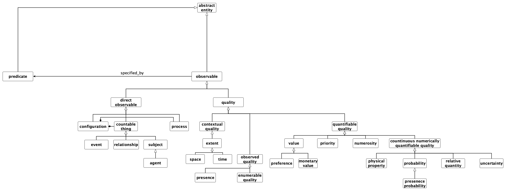
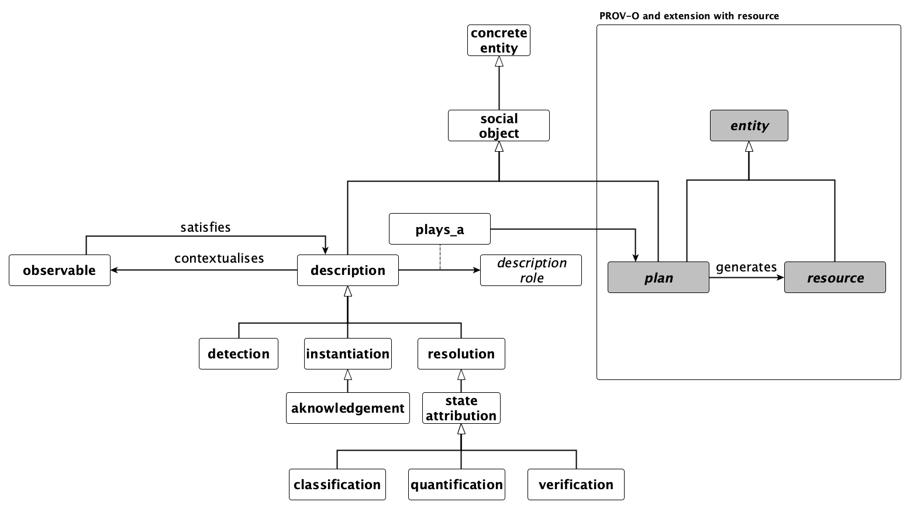
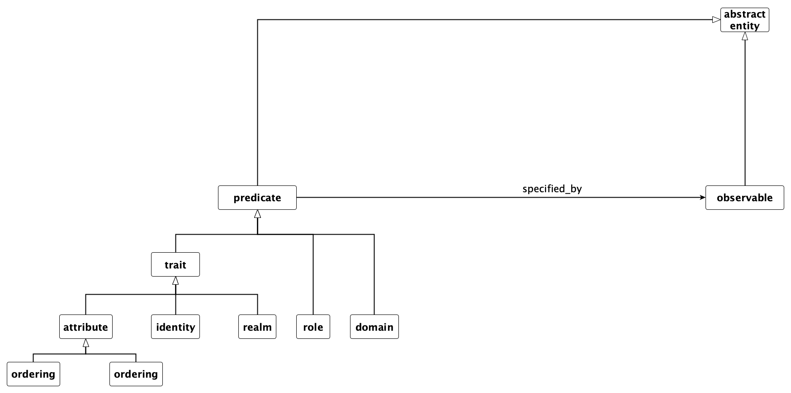

= Ontology of Descriptions and Observations for Integrated Modelling
(ODO-IM)
:author: Ferdinando Villa and Greta Adamo

== Introduction

The _Ontology of Descriptions and Observations for Integrated Modelling_
(ODO-IM, shortened _ODO_) is an upper-level ontology developed to
support a semantically enabled scientific process. ODO provides an
ontological foundation for the scientific descriptions developed using
k.LAB, a semantic web platform for science. The ontology is developed
and maintained by the _Integrated Modelling Partnership_
(http://www.integratedmodelling.org) (IMP), in support of its stated
commitment to modular, distributed, semantically explicit and integrated
scientific computing and modeling, according to the FAIR principles -
findability, accessibility, interoperability and reuse -
(https://www.go-fair.org/fair-principles/).

ODO assumes a descriptive perspective due to its purpose and, like other
upper ontologies (e.g. DOLCE, the Descriptive Ontology for Linguistic and
Cognitive Engineering), remains agnostic with respect to the
metaphysical status of the world in a fundamental sense. Yet, this
ontology postulates that scientific products and explanations are types
of conceptual objects and descriptions of observables
elements;footnote:[In ODO we do not aim at resolving or dealing with the
philosophy of science problem concerning observability/unobservability
(further readings can be found in ), we rather take a more ``practical''
approach useful for scientist and conceive observables as entities that
_can be_ observed either through the sense, such as objects and events,
or through the use of mediators, such as physical qualities that require
technology to complete the observation.] for this reason ODO is
primarily concerned with the representation of concepts and linguistic
elements. In addition, it assumes the ontological parsimony principle
based on the domain application. Note that ODO does not explicitly
mention in the taxonomy the distinction between universal and particular
that is often specified in and/or integral to foundational ontologies ,
such as the Basic Formal Ontology (BFO) and the Unified Foundational
Ontology (UFO) , however when a scientific description invokes countable
objects, such as physical entities, then we say that the description is
``instantiated'', thus created. While a clear commitment on universal
and particular is not part of ODO, the _concrete_ and _abstract_
categories can be found, similar to several upper ontologies.

The three backbone elements of ODO are (i) _description_ (concrete
entity), (ii) _observable_, (iii) _predicate_ (both abstract entities)
and their corresponding subclasses; the ontology builds upon _Provenance
Ontology_ (PROV-O) components that aim to trace origins and changes of
information and thus are crucial for representing scientific knowledge.
Concerning the alignment with other well-known upper-ontologies, in
particular DOLCE , BFO and UFO footnote:[See for a general overview of
foundational ontologies and their applications.], we recognise the
importance of integrating and reusing knowledge that has been already
produced and agreed upon across the communities of academics and
practitioners. Pursuant to this we offer a comparison and mapping at the
end of the appendix to evaluate possible integration (Appendix
link:#appendix_b[8]).

== From provenance to semantic modelling

ODO models the scientific process proceeding from standard provenance
terminology, and provides constructs that enable incorporating explicit
semantics into the provenance model of PROV-O, building the conceptual
foundation for the semantic web of scientific observations implemented
in k.LAB. At the core, the scientific process is seen as the
transformation of existing knowledge _artifacts_ into others that
incorporate and define scientific advancement; such transformations are
enacted (by _agents_) as scientific _activities_ (such as measurement,
symbolic integration or numeric simulation) under the guidance of
_plans_ representing the ``script'' for the transformation and
incorporating the scientific hypotheses and methodologies guiding the
process. These artifacts, agents, activities and descriptions have
direct counterparts in the PROV-O concept hierarchy: entity, agent,
activity and plan (see Appendix link:#appendix_a[6]).

In order to enhance the provenance model with an explicit
phenomenological grounding, we must first of all recognize that any
scientific artifact reflects a chosen ``overall'' entity of the world,
providing the spatial and temporal aspects for successive observations.
Therefore the first step of any scientific activity is the choice of a
_context_ of reference, including its phenomenological identity (e.g. a
river, a model organism, a region of space) and the required granularity
of description for any successive observations in it, such as the
representations of time and space (_scale_) adopted for the observation.
With this in mind, ODO extends the fundamental PROV-O classes as
follows:

* *Resource* is the ODO subclass of PROV-O _entity_ (see Appendix
link:#appendix_a[6]), representing any communicable, storeable artifact
that embodies scientific knowledge - such as a dataset, report or
equation. Resources are always semantically characterized by the concept
they describe (the _observable_) and are intended as directly
_actionable_, i.e. machine-readable in all of their parts and
implications with no human intervention.
* *Contextualization* is the ODO subclass of PROV-O _activity_,
representing the production of a Resource (using zero or more other
Resources) and recognizing that a Resource that serves as _context_ must
be provided (_acknowledged_) by the observing agent to bootstrap the
process.
* *Description* is the ODO subclass of PROV-O _plan_, which links a
semantic statement (the _observable_) to a computational strategy to
build a Resource that represents it. The k.LAB software stack defines an
AI-driven process that finds, connects and uses Descriptions from a
networked, distributed repository to respond to logical queries of the
form ``observe _observable_ in _context_''.

Based on these definitions, ODO provides a conceptual model to
facilitate:

. the definition of _Observables_, which state observable concepts and
their combinations through semantic operators and _Predicates_ that
intuitively capture complex meanings and linguistic distinctions
commonly adopted in day-to-day scientific practice;
. the definition of scientific methodological ``recipes'' (_models_) as
_Descriptions_ that have Observables as inputs and outputs, representing
the synthetic statements of scientific methods that are normally only
expressed as non directly actionable artifacts, such as equations in
scientific articles or complex computer code.

The conceptual architecture of ODO is not used directly by
practitioners, but is instead perused by writing statements in the k.IM
language, supported by the k.LAB software stack, which defines
ODO-compatible axioms using syntactic rules and conventions closely
modeled on the English language. The use of k.IM facilitates semantic
annotation and makes the building of integrated Semantic Web
applications accessible to the largest possible set of practitioners.

[[core]]
== ODO core elements

=== Observable

Observables are objects of knowledge that can be computed according to a
_description_ to produce a _resource_ (see Section link:#description[4]
and Appendix link:#appendix_a[6]). A Description provides a plan to
`contextualise` its target into a Resource that represents it within a
spatio-temporal and semantic frame of reference that provides a context
for its computation (the Description that produces the context itself is
a specialized subclass of Description, Acknowledgement - i.e.
"commitment", whose computational aspects are trivial). Observable(s)
can be further specialised using _predicates_ (Section
link:#predicate[5]), for example to narrow the semantic of an observable
using _attributes_.

Observables are organised in two sub-kinds, _direct observable_ and
_quality_. While the latter requires an intermediate entity of reference
in order to produce a Resource that represent it (e.g. a ``reference''
measurement - the _unit_ - is needed in order to carry out a
measurement) the former can be specified directly by simply recognizing
its existence. Figure #fig:observable[1] depicts the main classes of the
ontology of observables and how those relate with other elements.

==== Direct observable.

As introduced above, direct observables do not need a mediator to exist
and, although the term ``direct observable'' might resemble a
phenomenological entity, in this case a direct observable denotes the
entity type to justify the existence of latexmath:[$that$] possible
scientific description of a phenomenon.

Among direct observables we recognize three main subclasses, which are
_configuration_, _countable thing_ and _process_. (i) Configuration is
intended as an observable aggregation or "pattern" resulting from a 
combination of qualities or relationships; in this sense a
configuration could be the abstract counterpart of a particular
__situation__, i.e. a complex entity composed of participants,
event/process/state and are contextualized in a timeframe . (ii)
Countable thing defines an entity that exhibits unity and are considered
as ``whole'' at the scale of observation. (iii) Process are patterns of
behaviour that are realised as token and experienced directly at time
latexmath:[$t$] . Processes are open-ended and embed _changes_ that can
`affect`s a quality.

Countable things are divided in _subject_, _event_ and _relationship_. A
subject is a substance/substantial (here adopted in a similar fashion to
and ), thus is not dependent for its existence on other entities, such
as qualities. Examples of particular subjects are a lamb, a table and an
artificial agent. Only a subject can act as context for other
observations, i.e. the first Resource in any scientific process modeled
according to ODO must be an acknowledged subject. An _agent_ is a
specialized subject that has agency, including the capability of making
observations in a context of its own choosing.

The term ``event'' is typically considered as an instance, i.e. token or
occurrence, that is composed of temporal parts, is dependent upon their
participant and happen in time . However in the case of ODO, events are
observables, thus types of occurrences, that have a starting and ending
point so that they can be defined as an historical record rather than an
experiential one, as happens in the case of processes ; we mentioned
above that processes engender change, however events do not . In this
respect the participants of an event can show property-based/qualitative
changes that happen during the duration of the event itself . Note that
an event can initiate a configuration and viceversa, and processes can
be part of an event depending on the scale .

Relationshipsfootnote:[Although we acknowledge the differences between
``relationship'' and ``relation'' (see ), for the purpose of this report
we will not enter in this specific discussion and we will use them as
synonyms.] are observables countable thing that connect subjects (for an
broader discussion see ). The relationships considered in ODO are
_material_ _external_ , i.e. the relationship, in order to exist, is
dependent upon a _relator_ that mediates the relation and the relata
(i.e. the elements that are in the relation) are also dependent on some
external characteristics or entities. The key subclasses of relationship
in ODO are _functional_ and _structural_: the former defines the
directional relation that connects two entities latexmath:[$A$] and
latexmath:[$B$] based on the existence of one or more processes.
Structural relationship, instead, is based on the existence of an object
(here used in contrast to a process or a event). So it can be said that
structural relationships engender or define subjects (e.g. parenthood
between human individuals engenders families) and functional
relationships engender/define processes; the k.IM language contains
constructs to make these semantic implications explicit.

==== Quality.

The second subcategory of observables is _quality_. Qualities in ODO are
abstract types that in order to exist entails _quality dimensions_ or
structures (ref), referring to the theory of conceptual spaces proposed
by Gärdenfors and applied in DOLCE and UFO.

_Contextual_ and _observed_ are the two higher subclasses of quality,
the former defines _spatial_ and _temporal_ aspects of a description
providing in this sense its context. Both are necessary in order to
frame the scale in which a description is given. From a phenomenological
point of view, the experience of time involves factors that range from
duration to granularity, ordering, and change ; nevertheless, ODO
focuses on the informational representation of time as a quality that
define the granularity and extent of a description. Following this
target, in this ontology time is treated as a way to capture temporal
features such as the duration of an event and change over a specified
_interval_ of reference, for example months or years . Spatial qualities
are also accounted for with a similar topological description, noting
important differences compared with temporal qualities, for example
variable dimensionality. The notions of extent and granularity, as well
as operations such as union and intersection, are similar in both
dimensions and can be accounted for in the same way. In ODO spatial
characteristics are represented in terms of regions of space that can be
associated to intervals to create temporal and spatial notions. In
addition to space and time, other dimensions may be used to account for
conceptual topologies (e.g. a multi-hypothesis space) over which
observed states, and consequently the representation of resources, may
be distributed.

Observed qualities are those that can be identified directly though
experience and/or instruments. These kinds of qualities include
_presence_, _enumerable_ and _quantifiable quality_. Presence specifies
the existence of the quality itself, a semantic equivalent of a boolean
“truth value"; _enumerable quality_ defines the quality on the basis of
a resemblance with other of its kind, thus providing quality
classification. The _quantifiable quality_ class expresses measurable
qualities referring to a unit of reference or fractions thereof, and
thus is assigned to a numeric value when an observation is concretized
(e.g. volume).

Quantifiable qualities are contextualized by _quantification_
descriptions and includes several subclasses ranging from _continuous
numerically quantifiable quality_, which includes important notions such
as physical property and probability, to _value_ that specifies monetary
and preference qualities referencing a specific value attribution and
trading system (see e.g. ).

Continuous qualities can be _physical property_, _probability_,
_relative quantity_ and _uncertainty_:

* Physical property is contextualized by _measurement_ and classifies
qualities of physical entities, such as subjects, those are divided in
_extensive_ and _intensive_ physical property. While extensive physical
properties are influenced by the physical structure of the inhered
entity, the same does not hold for intensive physical
properties.footnote:[For more details see the _IUPAC Compendium of
Chemical Terminology_ and
https://en.wikipedia.org/wiki/Intensive_and_extensive_properties.]
Examples of the former are _volume_ and _length_, instead of the latter
_temperature_ and _duration_.
* We define probability as the measurement of the likelihood of
occurrence of ``favourable events'' that is contextualized as a
_probability observation_. Probability has one subclass, called
_presence probability_, that frames the probability focus on subjects in
a certain context.
* When a quality requires another (compatible) quality in order to be
assessed is called relative and has a similar semantics as ``integral''
qualities in the conceptual spaces theory (ref).
* The last continuous numerically quantifiable quality is uncertainty;
as mentioned in , in the literature several definitions of uncertainty
can be found depending on the field, such as physics, mathematics,
statistics and epistemology, however generally speaking uncertainty can
be defined as partial epistemological content (i.e. information)
concerning a state or a result . In ODO uncertainty is treated as a
quantifiable quality that can be assigned to a description, with no
further assumption made about the method of measurement or range of
values, and is contextualized as _uncertainty observation_.

Moving towards other quantifiable qualities, _numerosity_ defines the
number of countable things in a group and is contextualized by the
_count observation description_. The quality class _priority_ describes
a monotonic ordering of concepts that is contextualized in terms of a
numeric _ranking_ description. The last element that belong to the group
quantifiable quality is _value_, which is contextualized in a
_valuation_ description. The notion of value is often overloaded and
debated : in ODO we follow the characterisation of value as a quality
assigned to an entity by a subject, typically and agent, on the basis of
specific criteria, thus values in this ontology are always attached to a
assignment context. Values can be _monetary_ or non-monetary (expressing
on a _preference_). The assignment of value as a priority, i.e. abstract
ranking, is based on the characteristics of the valued entity and can
potentially change over time .footnote:[The paper of Porello and
Guizzardi treats preferences as ternary relations, here we consider
unary predicates as the agent making the valuation is always explicitly
known in k.LAB and contextual to any observation made.]

== Description

The main concrete element of ODO, except for Resource that is derived
from the PROV-O, is _description_ (see Figure #fig:description[2]). This
is a conceptual entity, a kind of _social object_ that has no agency and
is dependent upon mental states . It defines one or more observable
aspects of the world within a scale of observation through a recipe that
allows creating a Resource that represents it in that context. Within
ODO, descriptions play the _role_ of a _plan_ (PROV-O entity); in fact
with descriptions a set of ordered activities undertaken by the system
to produce an outcome, i.e. _resource_ in PROV-O, are specified. More
specifically, descriptions are derived from the resource-in-input and
resource-in-output process. Descriptions are defined in k.IM using the
``model'' keyword, the set of which constitutes the content of the
semantic web implemented by k.LAB.

As mentioned previously, descriptions interface with observables by
providing a strategy to contextualize them, thereby setting the
conditions for observables to exist . Observables in themselves do not
have temporal, spatial or ``causal'' characteristics, yet descriptions
can materialize observables when invoked. The class _description_ is
divided in three first-level subclasses: _instantiation_, _resolution_
and _detection_.

* *Instantiation.* This kind of description reifies concepts, more
specifically countable things by building the Resources that incarnate
them into concrete token descriptions. In this way instantiation creates
actual concepts. An  _acknowledgement_ is a subclass of instantiation
that consists in the intention/commitment to creating one resource and
directly specifies all details of the outcome. The first step of any
scientific process is always the acknowledgement of one single resource
that serves as context for the remaining activities.
* *Resolution.* This type of description explains the concept through
its process realisation based on a scale: while instantiation only
produces a concept at time latexmath:[$t$] by invoking it, resolution
initiates a modelling process that results in a corresponding outcome.
* *Detection.* This class contextualises a configuration and can produce
a model resolution.

Resolution, which describes the explanation of a previously instantiated
observable, is further articulated as _simulation_ and _state
attribution_; the former is applied in the context of a process, the
latter is a concept container that includes all descriptions that
attribute ``values'' when applied: _classification_, _quantification_
and _verification_. These three subclasses of state attribution apply
respectively to enumerable qualities (whose attributed values must be
concepts subsuming a specified conceptual space, e.g. soil types),
quantifiable qualities whose values are numeric, and presence that can
be asserted by means of simple truth values (true/false).

Quantification presents the following subsumed elements (not included in
Figure #fig:description[2] for reasons of space): (i) _counting_, (ii)
_measurement_ (iii) _probability description_ (iv) _ranking_, (v) _ratio
description_ that expresses a relationship between two or more numerical
quantities that produce another number as outcome, (vi) _uncertainty
description_ which uses numerical data to express the uncertainty
concerning another state, and finally (vii) _valuation_ that produces a
numeric estimate of the "worth" of an entity in a given context and
perspective.

== Predicate

In the context of this ontology __predicate__s are abstract entities
that specify characteristics (e.g. properties, attributes or features)
of observables. A predicate can be a _trait_, _role_ and _domain_; while
a trait can be applied to an observable to specialize it in a sub-kind,
roles and domains do not, as they define external and relational
predicates of an observable (Figure #fig:predicate[3]) not directly
affecting its ``internal'' meaning.

=== Trait.

The notion of trait, widely used in biology and genetics with much more
domain-dependent semantics, is used in ODO as a generic
characteristic/feature predicated upon an observable, either a direct
observable or a quality, that articulates it in more specific kind.
Traits are often enumerable surrogates for qualities that cannot be
directly measured in a context, allowing their conceptualisation as
attributes and potentially including additional information in the form
of experiential effects rather than objective measurement (e.g. ``red''
as a color refers to reflecting light in a well-defined range of
wavelengths). The ODO class trait subsumes three elements:

* _attribute_ is the linguistic counterparts of a quality which can be
attributed to an observable by narrowing down its semantics, e.g.
``being a red cat'', and normally refers to implicit or explicit
observable qualities;
* _realm_ ``locates'' the entity-observable into a specific context not
directly observed as scale, e.g. the temperature of the sea surface: a
realm is a trait that stands for or relates to contextual qualities,
further specifying the spatial or temporal context beyond the scale of
observation, rather than relating to observed ones;
* _identity_ defines the representative properties, also referred to as
_intrinsic_ , that characterises an observable and places it in a
taxonomy, normally subsuming a large number of characteristics and/or
behaviors. Identities can be for example taxonomic (species, order,
family), chemical (element, compound) or locate an object along
well-known vocabularies (e.g. product or crop types). Although identity
is a widely debated and overloaded notion in philosophy (see e.g. SEoP),
we refer to it in terms of identity of terminological concepts, for
instance whether two descriptions of an object refer to the same object
latexmath:[$x$] ;

=== Role.

This predicate denotes non-rigid (ref) and contingent aspects of the
observable that come into play when the observable participates in
specific ways. For example, a process may confer a role to an observable
during its existence. We refer to a more extensive literature on the
notion of role HERE and HERE.

=== Domain.

Finally domain ties the observable to a discipline from which the
concept belongs through domain specific taxonomies, for instance
``elevation'' belongs to the geography taxonomy. The domain notion is
used in ODO to classify concept spaces rather than concepts, for example
to discriminate ontologies that deal with the physical realm vs. a
normative realm.

[[appendix_a]]
== PROV-O classes

An extensive description of the PROV-O elements can be found in , in
this work we simply report the PROV classes that we included, which are:
_activity_, _entity_, _agent_, _instantaneous event_ and _role_ (and
their subclasses). Two remarks have to be made for the entity concept,
which in the PROV is conceived as a synonym of artefact/informational
object. First we added a description as an entity that play the role of
a plan that is a subclass of entity, and second we defined another
subclass of entity that is _resource_.

Focusing on resource, as mentioned in the introduction, this element in
ODO is `generated by` by some contextualization of observables and is
any artifact that lives in the ``resource layer'' of k.LAB. This
includes literals, datasets, data services, computations and
computational services without a semantic characterization. Resources
are uniquely identified by a URN which are resolved to their
contextualized values through network services.

== Properties

=== Object property.

In ODO while 20 object properties are imported from the PROV-O, for
example `prov:wasInfluencedBy` that defines the agent-to-agent
responsibility, 16 object properties have been newly created for this
application. 10 of those have domain and range defined within the
observable class, those are:

* `affects`: a process affects a quality in its context when it is able
to change the state of the correspondent quality as time moves on. If
this relationship exists, the state that describes the quality is
dynamic.
* `appliesTo`: allows restricting the range of observables that an
observable applies to.
* `exposesTrait`: has as a domain an enumerable quality and as a range a
trait.
* `hasDestination` and `hasSource`: define the links between types of
relationship and the class of subjects.
* `hasRole`: points to the roles of an observable in the current
context.
* `impliesDestination`: this object property is used for a role that
applies to a relationship, to restrict the type of destination the
relationship can lead into.
* `impliesObservable`: this property embodies the notion of
``implication'' of another observable, whose existence is implied by
observing a particular trait. For example, the trait ``warm'' implies
presence of a process in which energy moves particles causing heat, or
more prosaically, observability of buildings in a point implies that a
building is there.
* `impliesRole`:
* `representedBy`: can be used to restrict an observable when it is
observed through another - e.g. geographical direction by presence of
moss on trees.

Two object properties involve the class description, more specifically
`contextualizes`, which links a description to its observable, and
`hasScale` that bounds a description with its scale. One property
generically defines the dependencies between elements, which is
`relatedTo` and finally 2 properties...

=== Annotation and data properties.

Besides the annotation properties imported from the PROV-O, seven were
created for ODO, those are `baseDeclaration`, `isAbstract`,`isDeniable`,
which is used to indicate deniable traits, `isSubjective`,
`isTypeDelegate` that when added to an enumerable quality contextualize
traits and were not directly declared by users, so that they can be
recognized and translated in output and visualization, `orderingRank`
and finally `unit` that specifies a conventional quantity useful for
comparative analysis .

All the data properties of ODO are imported from the PROV-O and specify
as a range the date type ``date time''. For instance the data property
`generatedAtTime` refers to the time of creation of an entity, a.k.a.
resource.

[[appendix_b]]
== Upper-ontology comparison and mapping
