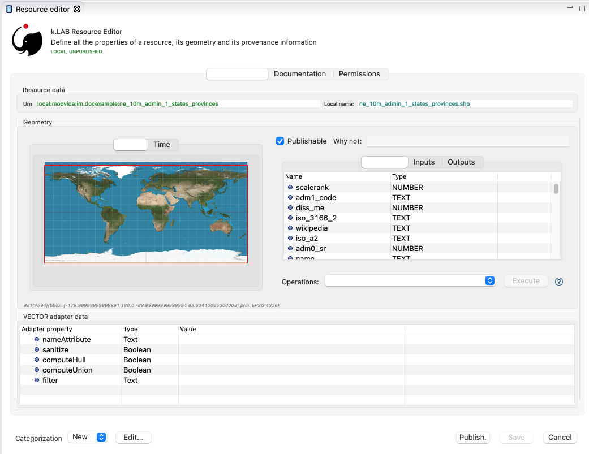
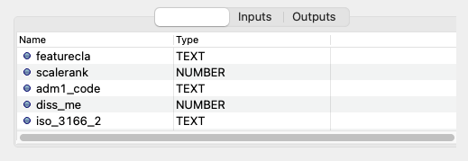

= k.LAB resources
A field guide to the lifecycle of resources in k.LAB and their adapters.
v1.0, 2021-02-20
:doctype: article
:description: Chat about resources handling with Villa
:kl: k.LAB
:kmod: k.Modeler
:kact: k.Actors
:keng: k.LAB Engine
:knod: k.LAB Node
:kim: k.IM
:ked: k.LAB Resource Editor
:pex: k.LAB Explorer
:kex: Project Explorer
:encoding: utf-8
:lang: en
:title-page:
:toc: left
:toclevels: 5
:sectnums:
:sectnumlevels: 5
:numbered:
:experimental:
:reproducible:
:icons: font
:listing-caption: Listing
:sectnums:
:autofit-option:
:mdash: &#8212;
:language: asciidoc
ifdef::backend-pdf[]
:title-logo-image: image:imgs/KLAB_LOGO.png[align=center]
:source-highlighter: rouge
//:rouge-style: github
//:source-highlighter: pygments
//:pygments-style: tango
endif::[]
:stem:

<<<

== Introduction

Resources are used in {kl} to make observations - finished scientific artifacts that describe a concept. This process involves:

* the choice of a _context_ for the observation (for example, a spatial region and a time period, at user-specified extents and resolution), and 
* a logical query (e.g. a concept, such as `geography:Elevation`) which is _resolved_ to one or more _semantic models_, producing a computational strategy that ultimately relies on resources to provide or compute data. 

This document describes the **Resources layer**, i.e. the bottom layer of three in the {kl} architecture, in which we find what is easily identified as "conventional" in the world of knowledge artifacts: datasets or data services, devoid of semantics beyond metadata. 

Importantly, in {kl}, _computations_, from simple equations to complex models, can also live in the resources layer. In fact, anything that takes inputs and produces outputs in numeric or other form, with no meaning explicitly attached beyond names and metadata, can be seen as a {kl} resource. Inputs and outputs will be similarly identified by a name and a type, for example numbers or textual categories. Imagine this as a black & white world, where the "standard" products of scientific research can live safely for a long time.

In the _semantic_ layer of {kl}, resources are coupled with concepts, creating an _integrated_ world of knowledge that the resources layer alone can't provide. This is where the world gets its _meaning_ - its colors! - and where integration becomes possible. In the resources layer, knowledge is only identified by names and basic types, such as numeric, textual, or boolean, and only basic validation of compatibility between resources is possible.

The aim of the resources layer is offering a common interface for k.LAB to access and manage pre-existing data, models and services of all kinds, as a first level of interoperability. 

NOTE: While the semantic layer specifies a _language_ for interoperability, the resource layer provides a _protocol_. 

The resource layer protocol is implemented as a simple, carefully designed API, enabled through the use of _adapters_, i.e. software plug-ins that adapt a specific data or service format to the API. Adapters are made available as {kl} _components_, installable in {keng}s and {knod}s, and can be extended by developers using the Java API to support formats and services not yet available.

This document looks at resources handling in a learn-by-example fashion, from two different angles:

* the _modeler_ perspective: using {kmod} to create, modify, test, access or delete resources;
* the _developer_ perspective: the Java API and classes used to manage resources in the {keng}.

This document assumes that the reader is already acquainted with {kmod}'s user interface and its {kl} perspective.

=== Example project

In the following sections an example project named **im.docexample** is used, which has been created using the default parameters of the project creation wizard.

Each {kl} project contains a resources node in its tree:

image::imgs/01_resources_tree.png[scaledwidth=40%, width=40%, align="center"]

Adding a file resource (ex. an ESRI shapefile, CSV file, or geotiff raster coverage) is as simple as dragging a file from the filesystem explorer to the resources node.

Let's for example add a https://www.naturalearthdata.com/[Natural Earth] world shapefile to the example resources by dragging it onto the Resources tree node. The resource is instantly imported and appears in the tree:

image::imgs/02_resources_tree.png[scaledwidth=60%, width=60%, align="center"]

The import process performs a number of validation steps to assure that the resource can be used inside {kl}. In this case, the projection and other attributes are checked for conformance with accepted conventions and the shapes are validated. In general, {kl} adapters are intentionally strict, and won't accept files that are partially or badly specified: all information is needed in order for resources to be adaptable to all context of use.

== The Resource Editor

{kmod} features a **Resource Editor** that allows the user to manage supported resource types. When selecting a resource previously imported into the resources tree, the editor opens, showing three tabs, the default one being the Resource data tab:

If the validation procedure had produced errors, the _Publishable_ checkbox won't be ticked and the _Why not_ textfield will describe the reason.

[NOTE]
====
Importing for example a multi-band imagery geotiff raster the same way as done with the shapefile, the editor reports an issue, and the URN is coloured red:

image::imgs/04_import_error.png[scaledwidth=100%, width=100%, align="center"]

It will be necessary to choose a band or provide a band mixer expression in the resource parameters to make the error go away and render the resource usable in a model.
====

The editor exposes important information about the resource:

* Its unique URN (Uniform Resource Name);
* Its attributes, if any exist;
* The geometry (space, time) and its textual encoding;
* All adapter attributes that define how {kl} will handle the resource.

Every resource also has a **data type**, which describes the main output. Because the type may change depending on the context of use, it is not shown in the editor. In the case of a shapefile the type is **OBJECT**, i.e. the resource, when applied to a context, will produce a set of objects, each of which will have its own independent geometry. In the case of a raster coverage, such as a geotiff or a WCS service, then the type would be **NUMBER**.

TIP: In the Java API, the possible types of a resource (also including many others that resources cannot produce) are defined in the `Type` enum which belongs to the `IArtifact` class. footnote:[org.integratedmodelling.klab.api.provenance.IArtifact - PROBABLY WE SHOULD HAVE MAVEN INSTALL JAVADOCS SOMEWHERE STABLE, AND LINK TO THAT INSTEAD]. 

=== Local and public URNs
[#REF_URNS]

Each resource can be identified as local or public. Upon creation the resource lives in a user project, and is therefore local. Modelers wishing to use that resource must have that project loaded in their engine's workspace. The name of a file-based local resource is derived from that of the original file: for example in case of a shapefile it is simply the file name without the path. The local name can be used as an identifier in place of the fully specified URN in {kim} models located the same project.
The URN (which can be copied to che clipboard by right clicking on the resource through _copy URN_) is the fully specified identifier and is the recommended way to reference resources in {kim} namespaces.

A URN consists of 4 parts, separated by colons:

* the **node name** (the name of the node where the resource was originally published);
* the **catalog** (a logical space handled by the node, for example a domain such as hydrology, or a name describing a large-scale collection of data);
* the **namespace** (a secondary logical space within the catalog);
* the **resource identifier**.

Dot-separated paths are normally used for each component of a URN, providing a further way to organize and document the origin and logical scope of a resource, using https://en.wikipedia.org/wiki/Reverse_domain_name_notation[reverse DNS notation] when appropriate. A clean URN should contain only lowercase identifiers and no other characters than ASCII letters or the underscore sign, although other characters are accepted.

When a resource is created locally, the four parts of the URN are used differently:

* instead of the node name, the string 'local' is used;
* instead of the catalog, the URN will contain the user name of the user that created it;
* instead of the namespace, the URN will contain the name of the project where the resource was created;
* the identifier will be built from the file name (if file based) or from user input.

A **local** resource's URN might for example look as follows:

----
local:moovida:im.docexample:ne_10m_admin_1_states_provinces
----

Once published, the URN of a resource will reflect the above described specification.

NOTE: One important note related to the node part in the URN: even if the resource will forever carry the originating node name in its URN, this doesn't mean that it can't be resolved by other nodes. {kl}'s mirroring API can be used to mirror resources to different nodes, to maximize the chance that a public resource is resolved even if some nodes are offline, and to support load balancing in the {kl} network for frequently used resources. 

There is a third type of resource, named universal resource (see <<REF_UNIVERSALRESOURCES, the dedicated section>>) that, due to its nature, follows a particular URN schema, identified by the **klab** prefix. 
If the URN starts with the keyword **klab**, then the meaning of the 4 parts of the URN are the following:

* the keyword klab;
* the name of the adapter to use to resolve it;
* the namespace to specify the service requested to the adapter;
* the identifier of the specific resource.

For example, the following URN

----
klab:weather:stations:all
----

turns into a request to the `weather` adapter for the `stations` service, which returns weather station objects with their data, and requests all the stations in the context of resolution (as opposed to, e.g., only those of a certain category or technology). The weather adapter may be installed in the local engine (in which case no node is involved in satisfying the request) or provided by one or more nodes on the network. In the latter case, the node with the lightest load at the time of request will be chosen to honor it.

Detailed information about URN internals can be found in the section _<<REF_RESOURCEMANAGEMENT, about URNs and resources management>>_. 

=== Attributes, inputs and outputs
[#REF_ATTRIBUTES]

Resources, when _contextualized_ to a context through a model, always produce an output corresponding to their main type - for example numbers or objects. In addition to their main output, they may expose additional outputs (for example, a numeric resource may also produce, on request, an uncertainty metric related to the main output) and may, in the case of computed resources, need or accept inputs. In addition, resources that produce objects or wrap multi-dimensional data sources such as tables may expose _attributes_, which can be referenced in models. 

As an example, a resource wrapping a vector spatial coverage (ESRI shapefile), which is of type OBJECT, has an attribute table:

If the resource is a computation, it may have the **inputs** and **outputs** tabs filled instead, or in addition to, its attributes tab. 

[NOTE]
====
In a resource, the main output, along with optional attributes, inputs and outputs, are defined by a name and a data type, and make the connection between the resources and the semantic level. These are referenced in semantic models using their names to connect to concepts in the semantic world.
====

The existence of attributes for an object resource allows it to be contextualized also as a "data" resource through a process called _dereification_. This corresponds to the removal of the object character by producing an attribute's value as the main output, and simply using the objects' spatial and temporal geometry to distribute its value over the context of observation. So assuming that the shapefile in the example had a numeric attribute named `population`, containing the number of people living in each region, the URN `local:moovida:im.docexample:ne_10m_admin_1_states_provinces#population` can be used in a model that observes the population size over a grid without any other modification. The adapter will take care of rasterizing as needed. Depending on the adapter, parameters in the URN may be used to filter the data, modify them, or trigger sophisticated operations of different kinds.

=== The geometry

Each resource has a _geometry_, which describes the _topology_ over which the resource's information is distributed. A geometry may be trivial (_scalar_, describing a single value that does not change in time or space) but more typically contains _dimensions_, such as time and space. The geometry descriptor is normally initialized during the validation process when the resource is created, and may, under some circumstances, be edited by the user to add missing information. 

Geometry data are summarized in an expression that is visible in the resource editor for inspection and cannot be modified directly. For the example shapefile it states:

----
#s2(4594){bbox=[-179.99999999999991 180.0 -89.99999999999994 83.63410065300008],proj=EPSG:4326}
----

The string, generated by the validator, can be read as follows:

* The resource contains 4594 objects (defined by the presence of the **#** denoting multiplicity of objects, and the number in parenthesis for the _size_ of the resource in this dimension);
* each object has irregular spatial bidimensional geometry (defined by the lowercase **s2**);
* the spatial dimension has two attributes, shown between curly brackets:
** a bounding box in projected coordinates;
** a projection (Lat/Long)

Information in the resource string is also displayed in the temporal and spatial widgets in the resource editor, making it unnecessary to interpret the geometry string directly; for trained eyes, though, the string offers much information in a very short form and it can be useful to read it. The {kl} Java API can manipulate the string definition and convert it to any internal representations needed.

The resource editor does not offer at the moment a way to edit the spatial geometry; a full-fledged time dimension editor is instead provided.

Dimensions may also be _regular_ (for example a gridded raster will show **S2**, with an uppercase **S** indicating regularity in space) or _generic_ (using Greek letters), meaning they imply a spatial dimension but do not indicate which one. Similar considerations as for space apply to time.

As shapefile sources contain no temporal information, the user can edit the temporal geometry using the time editor in the second tab of the geometry panel, which by default focuses on the space tab showing a world map. 

image::imgs/03_resource_editor_time.png[scaledwidth=70%, width=70%, align="center"]

After that is done (for example to state that the spatial data refer to the year 2020 and should be considered unchanging over a year's span) and the resource saved, the geometry shown will include the temporal information, for example:
----
τ1{tend=1609459200000,tstart=1577836800000,ttype=logical}s1(4594){bbox=[-179.99999999999991 180.0 -89.99999999999994 83.63410065300008],proj=EPSG:4326}
----

To show a slightly different example, this is what it might look like for a raster:

----
τ1{tend=978307200000,tscope=1.0,tstart=946684800000,ttype=logical,tunit=year}S2(4319,2159){...}
----

In this case, a raster grid of dimension (x = 4319, y=2159) has been annotated to refer generically to year 2000 (expressed in milliseconds after 1/1/1970): the data will also be used by k.LAB to make observations when contextualizing in a period beyond 2001, as long as there are no better sources of information for more recent years. A specific time extent (with a **T** instead of **τ**) would cause the resource to only be used within the time coverage specified.

=== Adapter parameters
[#REF_ADAPTERATTRIBUTES]

The _adapter_ is the software plug-in that takes care of validating, interpreting, encoding and decoding the original contents of a resource to adapt them to the {kl} world. Each adapter has different functionalities and defines a set of parameters that control the way the resource is interpreted. Many of these parameters are filled in automatically when the resource is imported from a file; if instead the resource is created from scratch, the user will be requested to fill in the mandatory parameters before the resource can be created. The parameters remain available in the editor for modification: users cannot add arbitrary parameters, but the adapter will add an empty definition for all optional parameters so that they can be filled in later if desired.

The adapter properties view lists the name and parameters of the currently used adapter. In the discussed test case the used adapter is the **VECTOR** adapter:

image::imgs/09_adapter_table.png[scaledwidth=80%, width=80%, align="center"]

The specific role of each parameter is discussed in the documentation of each individual adapter. As an example, the filter parameter seen in the picture can be used to exclude part of the resource, if necessary. The procedure is as simple as inserting a CQL (https://docs.geoserver.org/latest/en/user/tutorials/cql/cql_tutorial.html[Common Query Language]) based on the object's attributes (ex. _adm1_code=SOMECODE_). Adapters that operate on more flexible resources (such as tables or machine-learned classifiers) can contain a high number of parameters, which are often organized hierarchially for ease of navigation.

Modifying parameters enables the "Save" button in the editor. Saving the resource triggers revalidation and will result in errors if the parameter values are incompatible with the functionality of the adapter.
 
=== Publishing a resource

Resources start their life as _local_ within a user project, and can be used inside the project that contains them or in any other project that shares the same local workspace. While local resources may be enough to use them in {kl} for a specific, short-term project, the natural lifecycle of a resource continues with _publication_, which makes it available across the {kl} network. When published, resources become independent of projects, their URNs gain an "official" status following a _linked data_ paradigm, and live on {knod}s which may optimize their data for faster serving and have them mirrored to other nodes for increased availability. While public resources may be visibile, at the choice of their owner, only to selected users or groups of users, their URLs are universally recognized and can be used in {kim} models without the need for any registration or download, as long as the user is connected to the {kl} network.

The publish button in the {ked} helps the user in the publishing process with a dedicated wizard:

image::imgs/10_publish_dialog.png[scaledwidth=70%, width=70%, align="center"]

[CAUTION]
====
The publishing facilities in {kl} are in active development, and many important details are yet to be defined. In general, a resource can only be published after a number of validation steps, including full metadata compliance and licensing information, validation at a stricter level than what requested for local usage, and conformity and uniqueness checks for the public URNs. **Once published, a resource should not be changed**, since changes in existing resources might break models that depend on them.

Among the many details of the publishing workflow, {kl} will eventually feature an optional peer review procedure (which will affect the prioritization of the resource when multiple alternatives are available) and a multi-criteria rating system. While the process is developed and tested with partners, it is important that users refrain from publishing resources unless directed by authoritative partners.
====

The publishing dialog also allows fine granularity in the specification of resource permissions. By default a resource is visible only to the user that created it. The _Public_ checkbox allows to make it globally visible. Finally, it is possible to make resources visible only to certain users and groups (comma separated list) or exclude groups/users.

NOTE: It is important to note that because resources are never used directly in {kl}, but rather through semantic models, users will never see permission errors due to accessing resources that they have no rights to. Any model using a resource that is not allowed for the user running it is automatically deactivated and cannot be chosen to resolve its observable concept; the resolution process will automatically find a computational workflow that can resolve the query in terms of visible resources only. This enables a smooth and graceful enforcing of permissions.

Before publishing, the metadata tab should be filled in with relevant metadata:

image::imgs/11_publish_metadata.png[scaledwidth=80%, width=80%, align="center"]

WARNING: Many users believe that information such as time and spatial context are part of the metadata. This is bad practice since they are part of the semantic and have their own place in {kl}.

=== Universal resources
[#REF_UNIVERSALRESOURCES]

In the <<REF_URNS,section about URNs>> local and global URNs have been discussed and a third type of resource has been introduced: universal resources.

A universal resource is basically a service and does not own specific resource storage on the filesystem. Therefore universal resources can be considered public and do not need to be created. In fact, both nodes and engine may host universal adapters: when a universal resource is referenced, the engine will first try to contextualize it using its own installed adapters; only if the requested one is not available the engine will lookup nodes on the network that have it and allow it for the current user, then, if multiple ones are available, choose the node with the lightest current load and use the node resource API to obtain the data in the desired context. Universal resource adapters are created by implementing the **IUrnAdapter** interface, which does not have import, export and validation methods and thus has a simpler API than a full resource adapter. One example is the **RandomAdapter**footnote:[org.integratedmodelling.random.adapters.RandomAdapter] that is able to handle URNs that start with: **klab:random:...**.

Any resource whose node name is **klab:** is a universal resource. This means that no physical node can be named `klab`.

The weather adapterfootnote:[org.integratedmodelling.weather.adapters.WeatherAdapter] is an example of a complex service implemented as a universal resource. Because it relies on a large database of weather data and stations, updated regularly from online sources and contributing institutions, it can only be implemented as a service; behind the scenes, constant processing ensures data validation and synchronization of several datasources (ex. NOAA-catalogued weather stations) that change in time and are often integrated with new information. The underlying data are saved in an internal database and are made available through the URN to models that need weather data relative to a specific temporal and spatial geometry. The {kl} weather resource can be accessed through the **klab:weather:...** prefix, where the catalog identifier specifies the weather service.

Universal klab resources can be served by different nodes the same way as it happens for other global resources. It is clear that while a random adapter resource - being very simple - can be run from any node, a weather adapter that would take days only to build the initial database will be accepted only on dedicated nodes. For that exacty reason only one node, **im.weather**, currently handles `klab:weather` resources.

=== Adding non file-based resources 

In cases in which the resource is not file-based and a drag-and-drop action cannot be used, the _new resource_ wizard can be launched by right clicking on the resources node and selecting the **New resource...** action. The wizard allows to define an id for the resource and select one of adapter types enabled for resource creation in the connected engine:

image::imgs/06_new_resource.png[scaledwidth=80%, width=80%, align="center"]

Once the adapter has been chosen, its parameters will appear, ready to be defined. The following image shows the example of the mandatory (red) and optional parameters of a WFS adapter:

image::imgs/07_new_resource_wfs.png[scaledwidth=80%, width=80%, align="center"]

In the image it is quite clear what the URN of the new resource will look like (Resource ID at the top) and how for the local resource the user selects only the last piece of the URN, the resource identifier.

== Local resources behind the scenes

Local resources are hosted on the local filesystem and belong to projects. The way things are handled behind the scenes can be understood when leaving the safety of the {kl} perspective by switching to the **{pex}** perspective:

image::imgs/08_project_explorer.png[scaledwidth=80%, width=80%, align="center"]

While the {kl} prespective shows a logical view of the resources, the {pex} presents a physical view of the resources, as they are persisted on the storage. The average user does not need to know the details of how resources are stored, but this information can help more advanced users understand resources and report problems.

CAUTION: File-based resources are _copied_ to the resources folder when imported, being it few bytes or many gigabytes, to ensure the self-consistency of the resulting resource. The user should be aware of ramifications when importing datasets and when committing projects that contain resources to git or other source code control system.

Looking into the **resources** folder we will find a folder for each created resource. Each resource also presents a **resource.json** file, which contains all information {kl} needs to know about. The json file is text-based and indented for readability, so the basic information from it is easily accessible in the {ked} user interface:

[source,json,linenums]
----
{
  "urn" : "local:moovida:im.docexample:ne_10m_admin_1_states_provinces",
  "version" : "0.0.1",
  "adapterType" : "vector",
  "localPath" : "im.docexample/resources/ne_10m_admin_1_states_provinces.v0.0.1",
  "geometry" : "#s2(4594){bbox=[-179.99999999999991 180.0 -89.99999999999994 83.63410065300008],proj=EPSG:4326}",
  "projectName" : "im.docexample",
  "localName" : "ne_10m_admin_1_states_provinces.shp",
  "type" : "OBJECT",
  "resourceTimestamp" : 1613125478144,
  "metadata" : {
    "im:keywords" : "features,ne_10m_admin_1_states_provinces",
    "dc:title" : "ne_10m_admin_1_states_provinces"
  },
  "parameters" : { },
  "localPaths" : [ "im.docexample/resources/ne_10m_admin_1_states_provinces.v0.0.1/ne_10m_admin_1_states_provinces.shx", "im.docexample/resources/ne_10m_admin_1_states_provinces.v0.0.1/ne_10m_admin_1_states_provinces.dbf", "im.docexample/resources/ne_10m_admin_1_states_provinces.v0.0.1/ne_10m_admin_1_states_provinces.prj", "im.docexample/resources/ne_10m_admin_1_states_provinces.v0.0.1/ne_10m_admin_1_states_provinces.shp" ],
  "history" : [ ],
  "notifications" : [ ],
  "attributes" : [ {
    "name" : "featurecla",
    "type" : "TEXT",
    "key" : false,
    "optional" : true,
    "exampleValue" : null,
    "index" : 0
  }, 
  ...
  
  ...
  
  ...
  {
    "name" : "ne_id",
    "type" : "NUMBER",
    "key" : false,
    "optional" : true,
    "exampleValue" : null,
    "index" : 0
  } ],
  "spatialExtent" : {
    "east" : 180.0,
    "west" : -179.99999999999991,
    "north" : 83.63410065300008,
    "south" : -89.99999999999994,
    "gridResolution" : null,
    "gridUnit" : null
  },
  "dependencies" : null,
  "outputs" : null,
  "exportFormats" : {
    "shp" : "ESRI shapefile"
  }
}

----

== Finding resources

To help users find resources when writing models, the {kmod} offers a resources finder view:

image::imgs/12_resources_view.png[scaledwidth=80%, width=80%, align="center"]

On entering keywords in the search field, the view presents resouces whose URN matches the text. 

On double clicking on the resource, it is opened in the {ked} while with a right click it is possible to copy the URN to the clipboard, to use in {kim} models. The "Copy URN" action is also available in the {kex} in the right-click menu, along with operations to delete the resource or move it to another project.

The upper right combobox allows to set the filter on looking for the resource locally or on public nodes. When set to public, search is expected to operate not only on URNs, but also on metadata, descriptions and other information saved with the resources. The public view will also display status information on resources that are published from the local environment, allowing the user to list the resources published (including when publishing failed) and, if wished, remove from the nodes they are published to.

WARNING: At the moment the search API for nodes is not implemented, therefore the public search is not yet usable; the publishing feedback features are partially implemented and should not be relied upon.

== The developer perspective
[#REF_RESOURCEMANAGEMENT]

The following sections describe a Java developer's perspective on what has been seen in the previous ones. Notable code passages are used to explain the information flow and processes behind the {keng} and {kmod}.

=== URNs

Simple textual information on URNs is handled in the singleton **Urns**footnote:[org.integratedmodelling.klab.common.Urns - WE SHOULD PUBLISH THE JAVADOCS TO A STABLE PLACE WITH MAVEN BUILDS AND LINK TO THEM INSTEAD]. The class is a utility class that allows the developer to manage URNs. In addition to the methods in the `Urns` class, a string-based URN can be used to create a `org.integratedmodelling.klab.Urn` object which also gives access to URN parameters and is nicer to handle than a simple string.

NOTE: In {kl} we consider a URN any string identifier that can be connected to known objects in the {kl} ecosystem. So while a resource URN typically displays the structure discussed here, other objects such as concepts (e.g. `geography:Slope`), concept expressions (`im:Normalized geography:Elevation`) or model identifier (`im.data.global.dem90`) may also be referred to as URNs. All these can be considered short-hand forms that can, if needed, be expanded into a fully compliant URN form, including a common **urn:klab:** prefix. We do not normally need to do so when writing and discussing resources or models, nor when writing code using {kim} or {kact}. The full URN may be important for standardization in API communication.

One important information developers should be aware of, is the one expressed by the first attributes of the class:

[source,java,linenums]
----
	final public static String KLAB_URN_PREFIX = "urn:klab:";
	final public static String LOCAL_URN_PREFIX = "urn:klab:local:";
	final public static String VOID_URN_PREFIX = "urn:klab:void:";
	final public static String LOCAL_FILE_PREFIX = "file:";
----

Another information that the URN class (in conjunction with the Resources class, explained later) makes clear are the tree levels of URN visibility:

* local
* global
* universal

=== Resolving URNs to resources

URN resolution is handled inside the singleton **Resources**footnote:[org.integratedmodelling.klab.Resources].

While the instance of Resources can be accessed directly, it is a service (IResourceService) and as such it can be accessed throughout the system also from components that do not have directly imported the package of the implementation.

[source,java]
----
IResourceService service = Services.INSTANCE.getService(IResourceService.class)
----

Resource resolution is done by passing the URN to the **resolveResource** method. If the URN can be properly resolved, either locally or globally, an IResource object is returned. 

=== IResources

In the IResource interface we find various methods, whose functionality can be tracked back to the {ked} user interface (this should now sound obvious, since it represents the resource object). No API in the current version of {kl} can yet be considered stable and the details shown here may change. The methods are quite self-explanatory and are documented in Javadoc. Some of these are worth describing for better understanding without the need to access the source code:

* _getDependencies()_: resources can depend on other resources. If that is the case, the method will return a list of the URNs of said dependencies.
* _getGeometry()_: the resource's geometry. Geometries are quite complex in {kl} and can cover different extents (also time, not just space) and have different dimensions. Interested developers should head to the javadoc of the IGeometry interface to dive in the internals of geometries. It is important to understand that the scale (**IScale**footnote:[org.integratedmodelling.klab.api.observations.scale.IScale]) is the semantic version of the geometry. As such it is possible to create a scale from a geometry or vice versa. It is in the scale where the geometry finds a place in which space and time are understood through semantics, while at mere IGeometry level it represents a topologhy and that's it.
* _getVersion()_: each resource has a versioning system. Local resources don't obey to said system. But once a resource is published, a version 0.0.1 is attributed to it. At every change a version update is done. 
* _getHistory()_: each resource also contains a list of its history. The list contains all resources the current resource transitioned through in history, each with its own version.
* _getParameters()_: a resource can have parameters. Part of them can be created by the adapter that took care of a resource (the ones seen in section about <<REF_ADAPTERATTRIBUTES, adapter parameters>>). 
*  _getAttributes(), getInputs(), getOutputs()_: resources that produce objects can have a set of attributes, modeling resources can have inputs and outputs. These are visualized in the {ked} as shown in the <<REF_ATTRIBUTES, attributes>> section.
* _getAdapterType()_: the adapter type that is in charge of the resource.

It is important to note that resource objects are mandatorily created using the resource builderfootnote:[org.integratedmodelling.klab.api.data.IResource.Builder].

=== The resource adapter

Once a resource is imported into {kmod}  (for example dragging a file onto the resources node) the **importResource** method ot the resource service is called.

The first step in there is the choice of the adapter (**IResourceAdapter**) that can handle the resource:

[source,java,linenums]
----
IResourceAdapter adapter = null;
if (adapterType == null) {
    List<IResourceAdapter> adapters = getResourceAdapter(file, parameters);
    if (adapters.size() > 0) {
        adapter = adapters.get(0);
        adapterType = adapter.getName();
    }
} else {
    adapter = resourceAdapters.get(adapterType).adapter;
}
----

Once the adapter is defined, a set of tooling objects are made available through its API: a validator, an encoder, a publisher. To create a new resource adapter it is necessary to create an object that implements the IResourceAdapter interface but also its subobjects, as IResourceValidator, IResourcePublisher and IResourceEncoder.

The adapters are discovered by the system from their annotation (ex. in the raster adapter):

[source,java,linenums]
----
@ResourceAdapter(type = "raster", version = Version.CURRENT, 
    requires = { "fileUrl" },
    optional = { "band", "interpolation", "nodata", "bandmixer" }, 
    canCreateEmpty = false, handlesFiles = true)
public class RasterAdapter implements IResourceAdapter {
 //   ...
}
----

The IResourceValidator interface guides the developer in the implementation of the main validator functionalities:

* canHandle: the first and fastest check that defines if the adapted is able to handle the given resource.
* validate: implements the validation logic starting from a URL and userdata. Successfull validation results in returning a builder object used to then create the resource.
* update: a method that allows the resource to be saved as the result of user changes
* performOperation: if the resource allows to perform operations on the resource, it should be implemented. Operations are then made available to the user in the {ked} in the combobox below the <<REF_ATTRIBUTES, attributes table>>.

The **RasterValidator** class is a good startig point for developers that want to understand how the resource is created using the builder object. In the validate methods it is simple to track how spatial extent is defined, the projection is set or for example the geometry is defined:

[source,java,linenums]
----
Geometry geometry = Geometry.create("S2")
    .withBoundingBox(
        envelope.getMinimum(0), 
        envelope.getMaximum(0), 
        envelope.getMinimum(1),
        envelope.getMaximum(1)
    )
    .withProjection(crsCode)
    .withSpatialShape(
        (long) grid.getGridRange().getSpan(0), 
        (long) grid.getGridRange().getSpan(1)
    );
builderObj.withGeometry(geometry);
----

=== Contextualizing a resource

When a resource need to be contextualized, the **getResourceData** method of the **Resources** class is used.

There are various versions of the method that allow to iterate over the resource using a given scale (i.e. defined steps in sapce and time) or to simply iterate over the whole resource without a particular notion of scale.

[CAUTION]
====
At the current time the IResourceService doesn't provide the getResourceData methods, but might soon do that to expose them also in the service object. 

This can be particularly useful for components that do not have access to the engine, but need to validate other resources they concurr with.
====

The first step towards contextualization is to check whether the resource is local, global or universal. 

After a first simple URN check the resource is investigated on being local, global or universal (in which case it could still be local, since the universal resource could reside on the local node):

[source,java,linenums]
----
boolean local = Urns.INSTANCE.isLocal(resource.getUrn());

...

if (urn.isUniversal()) {
    local = getUrnAdapter(urn.getCatalog()) != null;
}
----

If it is local but also universal, then the adapter is retrieved directly from the catalog and used to build the data object (IKlabData):

[source,java,linenums]
----
IUrnAdapter adapter = getUrnAdapter(urn.getCatalog());
...
IKlabData.Builder builder = new LocalDataBuilder((IRuntimeScope) context);

...

adapter.getEncodedData(urn, builder, geometry, context);
IKlabData ret = builder.build();
----

If the resource is not local, then the workflow is uniform for global and universal resources, starting by finding the node, choosing the one with less load between the ones available. Then a REST request is prepared and sent to the node using a builder that creates the data that are retrieved from the resource:

[source,java,linenums]
----
INodeIdentity node = Network.INSTANCE.getNodeForResource(urn);

...

DecodingDataBuilder builder = new DecodingDataBuilder(
        node.getClient().post(API.NODE.RESOURCE.CONTEXTUALIZE, request, Map.class), context);
IKlabData ret = builder.build();
----

Generally speaking, if the resource is local, a **LocalDataBuilder** is used and passed to the encoder of the adapter. The encoder is the component that takes the resource and the scale and fills in all the necessary pieces of the data builder:

[source,java,linenums]
----
IResourceAdapter adapter = getResourceAdapter(resource.getAdapterType());

...

IKlabData.Builder builder = new LocalDataBuilder(context);
adapter.getEncoder().getEncodedData(resource, urnParameters, geometry, builder, context);
IKlabData ret = builder.build();
----

[NOTE]
====
If the case of a raster resource for example the encoder would take the geometry and create a subset, reproject and apply any necessary transform, then it would extract each x/y cell and pass them to the builder. Once the build method is called a **non-semantic** artifact is created. 

The non-semantic artifact, depending on the used builder, could be promoted to the semantic world. For example, when a model is run, the context passed to the LocalDataBuilder could provide an empty state (IState). The builder would then add information of the artifact to the state.
====

If instead the resource is public (aka global), a **DecodingDataBuilder** is used. It basically followes the same logic as the local builder, but using network protocols to retrieve the necessary pieces (using https://en.wikipedia.org/wiki/Protocol_Buffers[protobuf] for the serialization).

[source,java,linenums]
----
DecodingDataBuilder builder = new DecodingDataBuilder(
        node.getClient().post(API.NODE.RESOURCE.CONTEXTUALIZE, request, Map.class), context);
IKlabData ret = builder.build();
----

== Links, footnotes and resources

=== Footnotes

