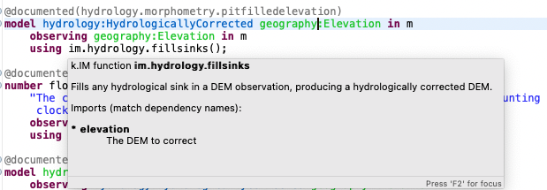
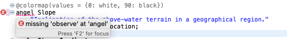

= The k.LAB Semantic Layer
Technical note
v1.0, 2021-02-27
:doctype: article
:description: The Semantic Layer
:kl: k.LAB
:kmod: k.Modeler
:kact: k.Actors
:keng: k.LAB Engine
:knod: k.LAB Node
:kim: k.IM
:ked: k.LAB Resource Editor
:kex: k.LAB Explorer
:pex: Project Explorer
:kim_manual: k.IM manual
:encoding: utf-8
:lang: en
:title-page:
:toc: left
:toclevels: 5
:sectnums:
:sectnumlevels: 5
:numbered:
:experimental:
:reproducible:
:icons: font
:listing-caption: Listing
:sectnums:
:autofit-option: true
:mdash: &#8212;
:language: asciidoc
:source-highlighter: highlightjs
:highlightjs-languages: kim, java, json
:highlightjs-theme: klab
ifdef::backend-pdf[]
:title-logo-image: image:resources_handling/imgs/KLAB_LOGO.png[align=center]
endif::[]
:stem:

<<<

{kim} is the declarative language used to specify knowledge to include in the semantic layer of {kl}. Its syntax is designed to provide a linguistic representation of the constraints of the core ontologyfootnote:[The base ontology can be found in the resources of the engine plugin in _klab.engine/src/main/resources/knowledge_ as a set of owl files.] in {kl}, so that its statement, once validated syntactically, can correspond to consistent and correct semantics. A {kim}  specification is a series of statements, whose most important types are **concept** and **model** definitions. 

## The main actors of the {kim} language

Before we enter the dark realm of how {kim}'s language is created and where it is validated, it is important for the reader to have a first view of the most important constructs that are used to annotate resources to create observations. 

### Qualities

**Qualities are continuant, non countable observables**.

As the spoken language suggest, a quality is "the quality of something" and therefore is inherent to an observable. The fact that most of the time that observable is a subject, which is continuant by definition, and a quality depends on a subject to be observed, makes the quality itself a continuant.

Its nature of **indirect observable** also forces the quality to be observed relative to a reference value (unit, classification system, currency).

Being indirect observables, qualities inherit the scale from their inherent subject. Therefore **spatial and temporal** representation are handled and mediated transparently.

Examples of qualities:

* geography:Elevation (a measurement)
* economics:Income (a value)
* ecology:CanopyCover (a percentage)
* hydrology:StreamOrder (a ranking)
* chemistry:Ph
* ecology:TerrestrialBiomass
* hydrology:CurveNumber

NOTE: Quantity is a particular case in which the quality can be quantified with numbers.

Qualities are defined **abstract** when it is not possible to observe them. Core concepts, which are concepts declared by linking to the ontology that defines them, are usually abstract qualities.

The smallest building block available in {kim} are core concepts. Length is an example of such a core concept. It is defined through the use of **equals core**, (which can be used only in the root namespace) and links the concept to the base ontology.

#TODO: check correctness of declaration of length in worldview.#
[source,kim,linenums]
----
abstract length Length
	equals core observation:Length 
	requires identity (Lineal or Areal or Volumetric)
;
----

The above declaration defines **length**, but also the alias **Length** (im:Length when used in a different namespace). That means that after this declaration the system knows that length means im:Length. 

[NOTE]
====
The reader should be aware that {kl}'s first objective is to hide the complexities of an ontology (still maintaining it for the validation of concepts) that models the world behind a semantic definition of the world that uses a natural language that onces learned, allows modellers to model the world in a simple way (well at least much simpler than having to use ontologies directly). For the brave {kl} that wish to look into the dark realm of the ontologies, the {kl} console makes the **reason parents** command available. This allows to look at what a simple {kim} **im:Length** hides in terms of ontology:

----
> reason::parents im:Length
observation:Length
   observation:IntensivePhysicalProperty
      observation:PhysicalProperty
         observation:ContinuousNumericallyQuantifiableQuality
            observation:QuantifiableQuality
               observation:ObservedQuality
                  observation:Quality
                     observation:Observable
                        bfo:BFO_0000001 (entity)
                     bfo:BFO_0000019 (quality)
                        bfo:BFO_0000020 (specifically dependent continuant)
                           bfo:BFO_0000002 (continuant)
                              bfo:BFO_0000001 (entity)
----

====

Once we know that an _im:Length_ concept exists it is possible to create the height concept as a quality that is a Length with a verticality attribute:

[source,kim,linenums]
----
abstract length Height 
	is Length
	inherits Vertical 
	requires identity Lineal;
----
#TODO: check if the "requires" can be removed"#

Both length and height are abstract concepts that reside in the **im** namespace. 
To make a quality concrete, the **of** keyword can be used.

Let's take for example the elevation. It's concept is defined in the **geography** namespace. It is a length defined as a height (quality defined in the _im_ namespace) of a location (subject defined in the _earth_ namespace):

[source,kim,linenums]
----
length Elevation 
	"Geographical elevation above sea level, as described by a digital
	 elevation model."
	is im:Height of earth:Location
----

While the definition of core concepts is of interest to semantic worldview creators, the ultimate goal of scientific modelers is the use of such a worldview, without the need to care about its core concepts. 

Modelers may for example want to model resources, concepts in their domain or particular environmental calculations. The following examples try to explain how this can be done using {kim}.

#### Modelling a resource

A quality can be used to annotate a data resource with semantic knowledge. To do so the **as** keyword is used:

[source,kim,linenums]
----
model im:data.global:geography:global.srtm90m
    as geography:Elevation in m;
----

Once the resource (here identified by its URN) is modeled that way, the system will be able to use it once there is a request for it. To say it properly the {kl} way:
**Once the system is queried for the elevation concept inside a context, the engine uses the resource to resolve that concept.**

#### Define specialized concepts for a domain

Attributes can be used to specialize qualities for particular domains. For example, the elevation used in hydrological models needs to be hydrologically corrected. The attribute that has to be applied to the concept of elevation is defined as:

[source,kim,linenums]
----
attribute HydrologicallyCorrected
	"Defines a specialized elevation quality that is adjusted so that water is not 
	 allowed to pool."
	applies to geography:Elevation;
----

and once that is available in the language, that concept can be modelled using for example a fill sinking algorithm:

[source,kim,linenums]
----
model hydrology:HydrologicallyCorrected geography:Elevation in m
	observing geography:Elevation in m
	using im.hydrology.fillsinks();
----

If the above model was the only one available in a particular {kl} environment, it would be picked every time a hydrologically corrected elevation requested. But what if a country would make its complete coverage available as hydrologically corrected elevation resources. In that case it would be possible to model them using their URN as:

[source,kim,linenums]
----
model im:data.global:geography:goodcountry.srtm90m_pitfilledmaps
    as hydrology:HydrologicallyCorrected geography:Elevation in m;
----

Once a hydrologically corrected elevation was requested, the system would have two models able to resolve the concept and in this special case it would pick the existing maps, if the picked region covers them , because it would be evidence-based.

WARNING: This example if purely educational. In reality also rescaling should be taken into consideration, since hydrological models most of the time work properly only using the data at their original resolution.


#### Modelling an environmental calculation

The previous example that was using the fillsinks function already revealed how a calculation can be done using a function. We should review that model and also show how {kmod} can support the scientist in writing models.

[source,kim,linenums]
----
model hydrology:HydrologicallyCorrected geography:Elevation in m
	observing geography:Elevation in m
	using im.hydrology.fillsinks();
----

Basically in the above snippet we are modelling a hydrologically corrected elevation in meters using the fillsinks function. The _observing_ part defines a dependency for the function, since the function needs the elevation as input data.

{kmod} supports informative popups when hovering with the mouse over concepts.
Stopping the mouse over the HydrologicallyCorrected attribute gives us information about its meaning:

image::semantic_layer_imgs/04_kmod_hovering1.png[scaledwidth=80%, width=80%, align="center"]

More interesting is the information given when hovering the fillsinks function:



In that case, apart of a description of the function, also the necessary input data are described. In this case we see that the import, whose name needs to match the dependency name, is elevation. Hence the need to add the _observing_ elevation part. If no name is set, the lowercase name of the dependency, with the namespace removed, is used. And that is how **geography:Elevation** gets **elevation**, which is exactly what the function expects.

On the same footsteps of the previous code snippet, it is possible to model something slightly more complex, as for example the probability of an event (landslide). It is calculated applying a formula using the **set to** keywords. The normalized elevation quality is given a name, which can be then used in the formula together with the other observables, being it qualities or models.

[source,kim,linenums]
----
model probability of earth:Landslide 
	observing
		soil_texture_landslide_effect,
		land_cover_susceptibility,
		im:Normalized geography:Slope named slope_factor, 
		im:Normalized geography:Elevation named elevation_factor,
		hydrology:DrainageDensity named drainage_density
	set to [ (0.3 * slope_factor) + (0.4 * soil_texture_landslide_effect) + (0.1 * elevation_factor) + (0.1 * land_cover_susceptibility) + (0.1 * drainage_density)];
----

As stated before already, naming a quality is not mandatory. The _named_ keyword creates an alias, which is locally defined to the model. In the above case, without naming the quality, _normalized_slope_ would have been used, which is not much different in size from _slope_factor_. But if we imagine _ratio of (not Pristine) Biomass over Biomass_, then using a well defined name like just _ratio_ can be of help.


### Subjects

**Subjects are continuant, countable observables.**

Subjects are the only observables that can stand alone, i.e. be the root context of other observations. They are physical **direct observations** and as such their statement is enough to put them into existence,

Examples of subjects: 

* earth:Region (the {kex} sets this to the current visible region for contextualization)
* infrastructure:CaravanSite
* earth:Location
* infrastructure:Trail
* earth:Mountain
* infrastructure:Aqueduct
* infrastructure:Hotel 
* infrastructure:UrbanPark 
* engineering:Vehicle 
* earth:Slope 
* biology:Insect
* biology:Plant 
* demography:HumanIndividual 
* biology:Individual 
* infrastructure:LocalRoad 
* infrastructure:Port 
* earth:Ridge 
* earth:Coastline 
* ecology:Tree
* infrastructure:Town 
* earth:WaterBody

Subjects are often used as context for other observations. For example, when declaring the quality Slope, a subject helps to specialize. A Slope is defined as an angle (quality) of a particular geo-location (subject):

[source,kim,linenums]
----
angle Slope
	"Inclination of the above-water terrain in a geographical region."
	is im:Angle of earth:Location;
----

When a subject is referenced to declare a new subject, attributes are used for specialization (note that in code below the **"earth:"** is missing, since all definitions are contained in the same namespace earth). A WaterBody (subject) is an aquatic (attribute) region (subject):

[source,kim,linenums]
----
thing WaterBody
	""
	is Aquatic Region;
----

### Attributes, Identities and Roles

Attributes, Identities and Roles are collectively called Predicates and allow to further specify concepts and resolve their caracteristics. They can modify an observable, but can't be observed themselves.

Predicates are used to categorize observables in order to refer to a subset of the category of observations that can be made of them.

For example, a rock is defined as a solid compount in the _im_ namespace (omitting its children here):

[source,kim,linenums]
----
identity Rock 
	"Rock is a naturally occurring solid aggregate of minerals and/or mineraloids.  In general rocks are of three types, 
	namely, igneous, sedimentary, and metamorphic."
	is physical:Solid chemistry:Mixture
----

Predicates can also be used to model observations by prodcuting a quality:

[source,kim,linenums]
----
number soil_texture_landslide_effect
	observing 
		type of soil:SoilTexture named soil_texture
	lookup (soil_texture) into SOIL_TEXTURE_SUSCEPTIBILITY_TABLE;
----

In this case the **type of** operator produces a quality from the soil texture predicate. 

This introduces us to the next chapter: semantic operators

### Semantic operators

Semantic operators are keywords, or groups of keywords (for better readability) that have the ability to transform concepts into different concepts. They can be applied to a single concept (unary) or join different concepts (binary).

Operators allow parsimony of specification and hence to keep the worldview small. 

#### Unary operators

Unary operators change observables of various types into qualities that represent a particular aspect of those observables or of their observation.

In the next section a few operators are listed. For a complete list refer to the {kim_manual}.

##### presence of

Produces a quality with true or false values representing the verification of the presence of a countable in the context.

It can be used to annotate resources:

[source,kim,linenums]
----
model 'local:akif.ortak:im.data.global:im-data-global-geography.GlobalMountainsK3Binary'
	as presence of earth:Mountain;  
----

Once that is available this model will be able to resolve the quality **presence of earth:Mountain**. 

Looking at a more complex example:

[source,kim,linenums]
----
model im:Differential hydrology:RunoffWaterVolume caused by ecology:Vegetation in mm
	observing 
		hydrology:RunoffWaterVolume in m named actual_runoff,
		hydrology:RunoffWaterVolume with landcover:BareArea in mm named runoff_without_vegetation,
		presence of earth:Stream named presence_of_stream
	set to [nodata(actual_runoff) ? unknown : (presence_of_stream ? 0 : (runoff_without_vegetation - actual_runoff)) ];
----

In this case the presence of a stream subject is observed as a dependency in order to allow a calculation to identify those sites that are on a stream against those that are not.

##### distance from/to

Produces a quality with the spatial distance between countables located in space.

For example:

[source,kim,linenums]
----
model distance to behavior:Recreational earth:Region in m  	
	observing 
		distance to conservation:ProtectedArea in m named distance_to_protected_areas,
		distance to earth:Coastline in m    named distance_to_coast,
		distance to earth:Waterway in m     named distance_to_streams,
		distance to earth:WaterBody in m    named distance_to_water_bodies,
		distance to earth:MountainPeak in m named distance_to_mountains
----

##### count of

Produces the quality expressing the numerosity of any countable.

For example if a resource expressing the population density is annotated as:

[source,kim,linenums]
----
model local:srwohl:im.data.global:im-data-global-demography.global_population_density_2020
	as count of demography:HumanIndividual per km^2;
----

It can then be used in a model (in this case a non semantic) as an observable:

[source,kim,linenums]
----
number population_density_factor                                   
	observing 
		count of demography:HumanIndividual per km^2  named population,
		landcover:LandCoverType without landcover:WaterBody named land_cover_type
    set to [def min = population.min
    	    return ((nodata(population) && (land_cover_type)) ? min : population)], 
    	    klab.data.normalize(); 
----

##### type of

Produces a quality that can have as values the concrete children of an attribute.

For example:

[source,kim,linenums]
----
number soil_texture_landslide_effect
	observing 
		type of soil:SoilTexture named soil_texture
	lookup (soil_texture) into SOIL_TEXTURE_SUSCEPTIBILITY_TABLE;
----


### The view of the modeller

Now that the main language constructs have been discussed, it is possible to discuss the view of the modeller (as opposed to the one of the concept creator on one hand, and the final user on the other hand).

Let's use the example of the mountain peak concept. It is a subject defined in the worldview as a children of a land formation inside the earth namespace:

[source,kim,linenums]
----
thing LandFormation is Terrestrial Region
	has children
		Escarpment,
		Hill,
		BreakFoothill,
		(Mountain),
		Dune,
		Cliff,
		MountainPeak
;
----

Outside the worldview it can be referenced as **earth:MountainPeak**. 


A modeller usually has the task to create an observation for a specific domain. To do so, the concepts need to be modelled so that they are observed in a context, hence producing an observation. This is necessary for the final user to be able to "see some result in a map"

Assuming we are modelling in the domanin of tourism and are interested in recreational areas.

First thing the modeller will do, is to model the mountain peak (a recreational area). One possible way to do that could be the following code snippet:

[source,kim,linenums]
----
model each earth:MountainPeak
	observing geography:Elevation in m
	using im.geomorphology.findmaxima(surface = elevation, 
		threshold = [(max - min) < 500 ? 10000 : max * 0.65], 
		radius = 8000);
----

The modeller would then make sure to do the same for other recreational areas, as for example rivers and lakes.

NOTE: Remember that a model is an observation strategy for an observable. In the above case the **each** keyword creates an instantiator (a model) of mountain peak (an observable) using a function that has a dependency on the quality Elevation (an observable).

For the final user to be able to ask for the distance of points in a map from recreational areas, the modeller needs to model that obervable and make the model available to the system.

Assuming that a mountain peak and rivers are such places, the model (omitting the final part, which is not of interest here) that the modeller would write would look like the following:

[source,kim,linenums]
----
model distance to behavior:Recreational earth:Region in m  	
	observing 
		distance to conservation:ProtectedArea in m named distance_to_protected_areas,
		distance to earth:Coastline in m    named distance_to_coast,
		distance to earth:Waterway in m     named distance_to_streams,
		distance to earth:WaterBody in m    named distance_to_water_bodies,
		distance to earth:MountainPeak in m named distance_to_mountains
----

And this incarnates the way {kl} works:

* the final user asks for an observable. He/she would use the {kex} for this purpose:

image::semantic_layer_imgs/06_distance_query.png[scaledwidth=70%, width=70%, align="center"]

* a model that can resolve the observable is found by the system. That is the snippet that has just been discussed.
* that model observs other observables, so the system looks for models for each of them. Once found (resolved), it takes all of them, builds a resolution graph, compiles it into a dataflow and executes it, creating all the observations that match the observables. In the above example for the observable *earth:MountainPeak* the *model each earth:MountainPeak* model is found and used to resolve the observable using the findmaxima function. The same goes for the other observables (rivers, lakes, etc).
* in the {kex} it is then possible to visualize all the observations. The distance to the peaks would then look like:

image::semantic_layer_imgs/07_distance_peaks.png[scaledwidth=80%, width=80%, align="center"]

The image reveals how all teh observations that concurred in the final resolution are presented to the user and could be visualized.


## {kim}'s language definition?

{kim}'s grammar has been created using the https://www.eclipse.org/xtend/[Xtend] project and its classes, both the xtend sources and its generated java sources reside in the `org.integratedmodelling.kim` plugin.

A quick look at the Kim.xtextfootnote:[org.integratedmodelling.kim/src/org/integratedmodelling/kim/Kim.xtext] class shows how the grammar is built using xtend.
To create concepts the https://en.wikipedia.org/wiki/QName[_qualified names_] notation is used, which is a particular way to express URIs with abbreviated syntax as https://en.wikipedia.org/wiki/CURIE[CURIE].

Basically a concept is expressed as _namespace:identifier_:

[source, kim]
----
// XTEXT
Model:
	observable=ObservableSemantics |
	namespace=Namespace? statements+=Statement*
;

Statement:
	conceptStatement=ConceptStatement ';' |
	modelStatement=ModelStatement ';' |
	upperOntologyStatement=UpperOntologyDefinition ';' |
	defineStatement=DefineStatement ';' |
	observeStatement=ObserveStatement ';' 
;

ModelStatement:
	 (annotations+=Annotation (annotations+=Annotation)*)? 
	 ((inactive?='void')? & ((projectPrivate?='project')? private?='private')?)? model=MODEL_TYPE body=ModelBodyStatement
;
----

Possible statements are:

* ConceptStatement: something that declares a concept. This is tipical of the worldviews, that declare building blocks (or core types). It is not tipical for namespaces on which modelers work. 
* ModelStatement: definition of models, usually introduced by the keyword **model**.
* UpperOntologyDefinition: a particular statement, that can be used only in the root namespace of the worldview. This requires a section per se, but basically it is about linking concepts found in {kl}'s worldview' to an externaly defined ontology in order to allow validation in terms of a different ontology.
* DefineStatement: used to define variables inside of namespaces. If properly declared, they can also be imported into other namespaces. Defines are usually not used when modelling, since in that case a modeler wants to declare semantically also constants, so they would be defined as models. One example of the use of define is the creation of tables, where the table is defined through a data structure similar to a json:
+
--
[source,kim,linenums]
----
define table elevation_lc_class_totals as {
	title: "Area covered by each landcover type and elevation range (km²)"
	label: "Land cover by elevation class, with totals"
	target: geography:Elevation in m
	columns: (
		{ title: "Elevation in m ({classifier})", filter: (0 to 500, 500 to 1500, > 1500) }
		{ title: "Total", summarize: sum, style: (bold bg_highlight) }
	)
	rows: (
		{ title: "{classifier}", filter: landcover:LandCoverType, target: im:Area in km^2 }
		{ title: "Total", summarize: sum, style: (bold bg_highlight) }
	)
};
----
--
* ObserveStatement: this is used as a fallback for cases in which the context supplied by the graphical user interface ({kex}) is not available. One example for this situation is the execution of a unit test. In that case, having no user interface, the context needs to be defined using the **observe** keyword:
+
--
[source,kim,linenums]
----
observe earth:Region named etnasnap
	over space(shape = "EPSG:4326 POLYGON (( 14.8336 37.8513, 14.8336 37.6126, 15.1375 37.6126, 15.1375 37.8513, 14.8336 37.8513 ))" 
		, grid="1000 m"  
	)
;
----
--

NOTE: A description of the syntax for each statement type can be found in the comments in Kim.xtext in each ***Body** section. For example _ConceptStatementBody_ for the _ConceptStatement_.


[#KIM_SYNTAX]
## {kim} syntax

As noted before, the most important types of knowledge that can be specified in {kim} are concepts and models.

Concepts are the building block of the world view and being core types, they are well defined, unique and immutable. For this reasons there is no need for a **concept** keyword. In the case of concepts the keyword of the core type is used directly such as **process, agent or temperature**.

[NOTE]
====
Core concepts are linked to the ontology through  **"equals core"**, that can be used only in the root namespace.

For example temperature is defined as:

[source,kim,linenums]
----
abstract temperature Temperature 
	equals core observation:Temperature;
----

After that any reference to **temperature** makes it automatically inheritor of **im:Temperature**, which again represents **observation:Temperature**.

For example the atmospheric temperature is defined as:

[source,kim,linenums]
----
temperature AtmosphericTemperature
	""
	is AtmosphericBottomLayer im:Temperature  within Location;
----

Actually this case also shows that the use of **im:Temperature** is still necessary when you need to contextualise something. In this case the derivation using **is - within** forces one to mention an existing concept. 
====

A model definition is instead introduced most of the types by the **model** keyword. Some exceptions exist, such as non-semantic models, that are introduced by the data type (**number, boolean or text**), or learning models, introduced by **learn**.

To modify or connect concepts as well as support the definition of models, other keywords are necessary. And since {kim}'s objective is to adhere as much as possible to the English language, the keywords are selected prepositions, adverbs, conjunctions and verbs from that language. A high number of keywords results into a beautiful fluid language but presents the downside of a steap learning curve for modelers. 

#TODO: should we reference a syntax manual?#


NOTE: {kim} is optimized for the use of semantics. Since the expressions found in the language are just declarative, it is not possible to write maths expressions with {kim}.

Syntax validation is leveraged in two steps in {kl}. The first is a fast syntax validation, which is useful for realtime feedback to the modeler. The second is the slower semantic validation, which bases on the first, but then calls the reasoner into the game find also logical errors.


### How does the syntactic validator work?

When opening namespaces in the {kmod}, one big help is represented by the syntax coloring, which allows users to get a first grip around the various types referenced in concepts and models by thir color. 

The modeler itself is not able to do machine reasoning, and even if it was, machine reasoning to validate syntax would be too slow for a realtime function as syntax coloring. Therefore there are two levels at which validation occurrs:

* the ontologic validation done in the modeler, which occurrs in realtime while the user writes code
* the semantic validation that the modeler delegates to the engine and occurrs when the model is executed. This is done by the internal reasoner.

To make things more clear, this is the error reported by the modeler when using a non existing concept (or writing an existing one wrong). In this concept:

[source,kim,linenums]
----
@colormap(values = {0: white, 90: black})
angle Slope
	"Inclination of the above-water terrain in a geographical region."
	is im:Angle of earth:Location;
----

when changing angle to angel the following appears at once:



While the error messager in this case doesn't address exactly the issue, it allows the modeler to identify easily the problem.

The syntax validator is also able to check for inconsistent type. If we try, in the exampe above, to define the angle Slope as a proportion of an angle:

image::semantic_layer_imgs/02_kim_syntax_error.png[scaledwidth=70%, width=70%, align="center"]

or a length:

image::semantic_layer_imgs/03_kim_syntax_error.png[scaledwidth=70%, width=70%, align="center"]


As already stated, the grammar that links to the base ontology is defined in the Kim.xtext file. Using that allows to express ontology concepts that are complex and long to describe, using a natural language. The xtext compiler generates a set of java classes that can then be used for validation. The generated classes contain beans that represent the various concepts of the grammar.

For example the concept statement contains:

[source,kim,linenums]
----
ConceptStatement:
	annotations += Annotation*
	((abstract?='abstract')? &
	(deniable?='deniable')? &
	(subjective?='subjective')? &
	(agentSpecifier=('deliberative' | 'interactive' | 'reactive') |
		(propertySpecifiers+=PROPERTY_TYPE (propertySpecifiers+=PROPERTY_TYPE)*) |
		attributeSpecifier='rescaling')?)
	concept=CONCEPT_TYPE body=ConceptStatementBody
	('named' name=NamespaceId)?;
----

and the generated class _ConceptStatement**Impl**_footnote:[org.integratedmodelling.kim.kim.impl.ConceptStatementImpl] contains beyond other things:

[source,java,linenums]
----
  @Override
  public EList<Annotation> getAnnotations()
  {
    if (annotations == null)
    {
      annotations = new EObjectContainmentEList<Annotation>(Annotation.class, this, KimPackage.CONCEPT_STATEMENT__ANNOTATIONS);
    }
    return annotations;
  }

  @Override
  public boolean isAbstract()
  {
    return abstract_;
  }
----

The syntactic model is then wrapped into various classes with the same name as the original and prefixed with **Kim** (ex. KimConceptStatementsfootnote:[org.integratedmodelling.kim.model.KimConceptStatement]). These classes hide the machine generated grammar classes behind a simple API while making use of them in the model.

For example they contain the definitions of all fundamental concept types for rapid classification. The IKimConceptfootnote:[org.integratedmodelling.kim.api.IKimConcept] contains all types in a nested enumeration class Type:

[source,java,linenums]
----
    enum Type {
        OBSERVABLE,
        PREDICATE,
        QUALITY,
        PROCESS,
        SUBJECT,
        EVENT,
		...
        SUBJECTIVE,
        INTERNAL,
        ROLE,
        DENIABLE,
        CONFIGURATION,
        ABSTRACT,
		...
        LENGTH,
        MASS,
        VOLUME,
        WEIGHT,
        MONEY,
        DURATION,
        AREA,
		...
	}
----


They are used by the modeler to do fast syntax validation, but also passed on to the engine reasoner, where they are wrapped in different classes (ex. IConcept) to be then used in the reasoner.

It is possible to check the types and identifiers also from the {keng} console. For example, running the command **reason info im:Temperature** will output:

[source,java,linenums]
----
 OWL identifier: observation:Temperature (may not be unique)
 k.IM definition: observation:Temperature
 Core observable: observation:Temperature
 Syntactic types: [OBSERVABLE, QUALITY, INTENSIVE_PROPERTY, ABSTRACT, TEMPERATURE, QUANTIFIABLE]

        Context type: NONE [direct: NONE; in resolution: NONE]
       Inherent type: NONE [direct: NONE]
        Causant type: NONE [direct: NONE]
         Caused type: NONE [direct: NONE]
           Goal type: NONE [direct: NONE]
       Adjacent type: NONE [direct: NONE]
     Compresent type: NONE [direct: NONE]
   Co-occurrent type: NONE [direct: NONE]

 Metadata:
   observation:isAbstract: true
   observation:isCoreKimType: true
   klab:localAlias: im:Temperature
   observation:unit: K
   im:is-rescaled: false

 Default unit: K

 Observation type: QUANTIFICATION
 Generic: false
----

and running **reason info earth:AtmosphericTemperature** will output:

[source,java,linenums]
----
OWL identifier: earth:AtmosphericTemperature (may not be unique)
k.IM definition: earth:AtmosphericTemperature
Core observable: earth:AtmosphericTemperature
Syntactic types: [OBSERVABLE, QUALITY, INTENSIVE_PROPERTY, TEMPERATURE, QUANTIFIABLE]

        Context type: earth:Location [direct: NONE; in resolution: earth:Location]
       Inherent type: NONE [direct: NONE]
        Causant type: NONE [direct: NONE]
         Caused type: NONE [direct: NONE]
           Goal type: NONE [direct: NONE]
       Adjacent type: NONE [direct: NONE]
     Compresent type: NONE [direct: NONE]
   Co-occurrent type: NONE [direct: NONE]

Traits:
    earth:AtmosphericBottomLayer [indirect] [PREDICATE, TRAIT, REALM]

Metadata:
   klab:conceptDefinition: earth:AtmosphericTemperature
   observation:baseDeclaration: true
   im:is-rescaled: false

Default unit: K

Observation type: QUANTIFICATION
Generic: false
----

In both the above the _syntactic type_ lists the fundamental types that describe the concept.


The same IKimConcept class defines subgroups (EnumSet) of Types to be able to intersect quickly concepts and obtain a classification. One example is the check for trait type, for which the TRAIT_TYPES enumset can be used.

[source,java,linenums]
----
public static final EnumSet<Type> TRAIT_TYPES = EnumSet.of(Type.ATTRIBUTE, Type.REALM, Type.IDENTITY);
----

#### But how is syntax validation really done?

As seen in the previous section the xtext compiler compiles the beans for the grammar, but it also supplies a template for a syntax validator (in this case KimValidatorfootnote:[org.integratedmodelling.kim.validation.KimValidator]) that can be filled with domain knowledge validation using the xtend language (which clearly has been done by the {kl} authors).

So when for example a namespace is parsed, the check method from the generated java class is called:

[source,java,linenums]
----
	@Check
	def checkNamespace(Namespace namespace) {

		var ns = Kim.INSTANCE.getNamespace(namespace)
		var i = 0
	...
	}
----

NOTE: The whole grammar part is contained in the kim plugin and is used both in the modeler and in the engine. Note that the objects used (ex. Namespace in the above example) are the generated grammar beans and not some wrapper classes.

While the fast syntax check is not enough to be used solely in the reasoner, it helps to speed up things, since it can be used to do an initial validation and check WHAT the reasoner would be slower in.

The above snippet also reveals an important class, to which much of the heavy lifting of the validator is delegated: the singleton Kimfootnote:[org.integratedmodelling.kim.model.Kim]. 
This class resides in the kim plugin and has knowledge only of the API (not concepts or models or the engine). It is able to parse and evaluate information and produce parsed statements that are then ready to be understood and used by the engine.

#TODO understand how IKimConcept & friends are created and fit in the picture here#

The language parser produces peer objects prefixed by IKim to be identified easily. For example for IConcept there will be an IKimConcept. 

If we have a look at the above code snippet and look into the getNamespace method called on the Kim instance:

[source,java,linenums]
----
    public IKimNamespace getNamespace(String id) {
        return this.namespaceRegistry.get(id);
    }
----

we can see that the IKimNamespace interface is returned. This is the namespace object that comes from the language. In the engine then it will be necessary to translate it into a "real" namespace, that has a knowledge of what it really represents. The difference will be small in terms of class structure (many similar methods), but huge in terms of content, since one just represents the language, while the other one has to do actual reasoning work.

### How does the semantic validator work?

In the previous section it has been made clear that the syntax validator is triggered both in case of syntactic and semantic validation. Clearly, for the case of semantic validation, it is only the start. 

But when is semantic validation triggered? In the {kmod}, syntactic errors appear in realtime as we write. That means that the syntactic validator is called from the modeler at every character input. The semantic validator instead is called once the kim project is saved. Upon saving an interaction with the engine occurrs as can be seen  in the engine logs. The engine is contacted via websocket and the changed file is signaled:

[source,json,linenums]
----
{
  "type" : "ProjectFileModified",
  "messageClass" : "ProjectLifecycle",
  "identity" : "sqxob51umqq1u",
  "payloadClass" : "ProjectModificationNotification",
  "payload" : {
    "type" : "CHANGE",
    "file" : "/Users/hydrologis/.klab/workspace/moovida.fiddlearound/src/elevation.kim"
  },
  "id" : "1k1x8o3h1g6cw",
  "inResponseTo" : null,
  "notificationType" : null,
  "timestamp" : 1615973459025,
  "repeatability" : "Once"
}
----

When such a request comes in, the engine reloads the project file (using the Kim singleton class) and all its connected dependencies, triggering the reasoning workflow.

The first step is the translation of the syntactic beans into objects that have a semantic knowledge. This is done by the singleton KimKnowledgeProcessorfootnote:[org.integratedmodelling.klab.owl.KimKnowledgeProcessor] that takes IKimConceptStatement and converts them into an OWL based Conceptfootnote:[org.integratedmodelling.klab.owl.Concept] using its build method.

The translation is triggered by the listener KimNotifierfootnote:[org.integratedmodelling.klab.kim.KimNotifier]. This notifier is instantiated by the {keng} on startup and added to the Kim singleton:

[source,java,linenums]
----
	Kim.INSTANCE.addNotifier(new KimNotifier(this.monitor));
----

The notifier intercepts relevant events and is able to handle the fundamental entity of the knowledge in the projects, from which everything starts: the namespace. The conversion from the "syntactic" IKimNamespace to a "semantic" INamespace occurs in the method:

[source,java,linenums]
----
public INamespace synchronizeNamespaceWithRuntime(IKimNamespace namespace)
----

Inside the method a new Namespacefootnote:[org.integratedmodelling.klab.model.Namespace] and an error monitor is attached to it:

[source,java,linenums]
----
ErrorNotifyingMonitor monitor = new ErrorNotifyingMonitor((Monitor) this.monitor, ns);
----

And since the namespace is created using the IKimNamespace, which is a statment (IStatementfootnote:[org.integratedmodelling.klab.api.IStatement]), it has knowledge of the handled source code and is therefore able to define an error at a proper editor position with a relevant message to signal to the user.


// Inside the method the conversion is delegated to the knowledge processor.


## Concept vs. Model

Two types of namespace exist in {kim}. They are logically separated, even if they can reside in the same namespace: concepts and models. 

It is good manner to keep these separated, but it is possible to use them in the same project and namespace, for example for testing purposes.

In fact:

* concepts could be seen as the building blocks. They are carfully designed and thought by communities and are shared between them. They are usually synchronized in order to be used to build models on top of them. An example is the worldview of {kl}.
* models #TODO: DESCRIBE THEM IN THIS CONTEXT#

Concepts that use concepts from other namespaces, as for example in this case the reference to the _chemistry_ namespace

[source,kim,linenums]
----
abstract identity Nutrient 
	"Any chemical element or compound that is necessary to the ontogenesis of an
	 individual."
	is chemistry:ChemicalSpecies;
----

need to be declared in the namespace definition through the **using** keyworld:

[source,kim,linenums]
----
namespace biology
	"Fundamental biological concepts and relationships."
	using im, physical, chemistry
	in domain im:Nature
;
----

A workspace, which is an aggregation of projects, is loaded as a whole, preprocessing and loading the contained namespaces in order of dependencies. For this reason declaring dependencies is usually necessary. But given that

* the worldview is a particular workspace that is loaded before the others and assures to contain only concepts
* models can't have dependencies from each other by design

concepts need to make sure to obey to the laws of dependency declaration, while models do not need to, since all the concepts have already been already loaded when they are referenced.

An exception to the above would be the case in which a modeler defines a new concept in her/his local namespace together with a model and later on needs to reference that concept in a different namespace for another model. In that case the namespace import is necessary. This is legal, but should be avoided and left only to particular cases, one being the writing of unit tests.


## Concept vs. Observable

### Concept definition and declaration

It is important to differ between the creation (definition) of a concept and its reference (declaration) in the creation of another concept. The grammar of the first one is defined by the **ConceptStatement**

* syntax of declaration
* operators
* only one observable in the logical query

1:08

* concetto e' "about the what" il "che cosa"

[source,kim,linenums]
----
identity Rock 
	"Rock is a naturally occurring solid aggregate of minerals and/or mineraloids.  In general rocks are of three types, 
	namely, igneous, sedimentary, and metamorphic."
	is physical:Solid chemistry:Mixture
----

physical:Solid chemistry:Mixture is concept, not obervable 

* ConceptDeclaration -> look at Concept
** 1 or more concept 

1:11:30 operatori unari: trasformano concetto in altro

binari: prendono concetto e poi lo specificano ulteriormente (look ConceptDeclaration) -> ex of, for


1:13 semantic approach vs linguistic: ontologies you can use are all already mapped, while the linguistic approach links them together at runtime through the use of language.


concept is created (the **model proportion of (not conservation:Pristine) earth:Region caused by demography:HumanPopulation**):
[source,kim,linenums]
----
model proportion of (not conservation:Pristine) earth:Region caused by demography:HumanPopulation
	observing landcover:LandCoverType named land_cover_type
	lookup (land_cover_type, ?) into HEMEROBY_TABLE
	set to [self/7.0],
	klab.data.normalize();
----
and can be reused as such:

[source,kim,linenums]
----
model im:Theoretical value of behavior:Outdoor behavior:Recreation 
		observing 
		proportion of (not conservation:Pristine) earth:Region caused by demography:HumanPopulation named human_influence, 
        distance to behavior:Recreational earth:Region in m named distance_to_recreation
    set to [ (human_influence == 1) ? unknown : ((human_influence ** 1.5) * (distance_to_recreation ** 0.25))]
    then [ self.invert() ]; 
----

1:15.40 concept is normalized -> order and parenteses 

* this allows a string search of concepts
* the normalized declaration is always contained in the metadata (i.e. from Concept (engine IConcept part) it can be gotten through **getDefinition()** )) -> also KimConept can do thaat

1:18:27 

1:19:13 when writing a model the "what" is not enough, I also need a "how"

* unit is not part of the semantics!


## API

#TODO#

Look at API class that contains all the possible API calls.
 


## Authorities (Vocabularies)

#TODO#

Notes:

* authorities are annotated with ```@Authority```
* example IUPAC: `org.integratedmodelling.authorities.iupac.IUPACAuthority`
* the authority service makes them available throughout the system (`org.integratedmodelling.klab.api.services.IAuthorityService`). 
* the main implementation is `org.integratedmodelling.klab.Authorities`, authorities are collected on object instantiation
* `org.integratedmodelling.klab.owl.OWL` should make use of it, #but I could not find how.# 
 

## Appendix 1: Sparse knowledge

### Namespace

The **namespace** in this document represents the fundamental entity of knowledge that is processed. The term namespace can have different meanings depending on the expertise of the reader. For that reason, in case of doubt or confusion, we suggest to initially see the namespace simply as the content of a file inside a project of the {kmod}. 

### Continuants and occurrents

A **continuant** is something that exists at an instant in time. This actually means that it can be defined without the use of time. For example qualities (elevation, income, canopycover, ...) are continuants as well as subjects (mountain, town, waterbody).

An **occurrent** is something that has a time component. Events (spring, month, flowering, birth, homicide) are occurrents, as are processes (snowmelt, sorfaceflow, growth, freezing, melting).

### Non semantic models

Non semantic models are sintacticalli uniform with semantic ones. As described in the <<KIM_SYNTAX, {kim} syntax chapter>>, they are not annotated with the **model** keyword, but for example with **number**.

[source,kim,linenums]
----
number population_density_factor                                   
	observing 
		count of demography:HumanIndividual per km^2  named population,
		landcover:LandCoverType without landcover:WaterBody named land_cover_type
    set to [def min = population.min
    	    return ((nodata(population) && (land_cover_type)) ? min : population)], 
    	    klab.data.normalize(); 
----

These models actually represent a resource and do not concurr in concept resolution. But they use inputs from the semantic layer without fear.


### A little digression about names

#TODO#

quel che conta e' "nomi di cosa": non sono nomi per "concetti" ma per gli osservabili che dovranno risolvere le dipendenze, ed includono la semantica dell'osservazione (how) e non solo quella dell'osservabile (what). Quindi l'observable e' un concetto "vestito" di nomi, unita' di misura, operatori per cambiare i valori, etc., tutti usati localmente al modello di cui fa parte.

hmm no direi che non c'é relazione, l'observable e' un superset dell'espressione logica che chiamo "concept" (potenzialmente piu' di un concetto, tipo Normalized Elevation). 

Ora, il concetto ha una forma normalizzata gia' dalla sintassi (IKimConcept) con tutti gli elementi scritti in un ordine predicibile e parentesizzata dove serve, che quindi ha valore di identificatore unico. Quella la prendi sia da IKimConcept che da IConcept con getDefinition(). 

Ma non e' un nome - il concetto non ha nome, o meglio, gli si puo' chiedere un CodeName o una display label ma senza garanzia di unicita'. Quando lo usi in un modello, lo vuoi osservare - quindi specifichi, in aggiunta al concetto, anche le info necessarie perche' il risultato dell'osservazione sia utilizzabile: questo puo' includere unita' di misura, se e' una physical property (che e' una quality), o la currency (se e' un monetary value, che e' un'altra quality) e/o un nome quando all'osservazione vuoi fare riferimento in una formula o la devi legare a un calcolo "esterno", i.e. non semantico come in una funzione della HM. 

L'insieme dell'espressione logica + tutte le rimanenti informazioni, quando ci sono, e' un osservabile; i modelli listano osservabili sia come input (observing o1, o2...) che come output (model o1, o2, ....). Se guardi la grammatica vedrai che ci sono anche altre cose, meno usate ma importanti, che puoi fare con un osservabile, tipo metterci davanty 'any', 'all' o 'only' (come dire, qualunque cosa abbia un ruolo o un attributo, non tutti usati al momento) o aggiungerci un range (1 to 10) o "value operators" tipo "where (geography:Elevation > 200)" che non toccano la semantica ma solo i valori osservati. A un osservabile puoi anche aggiungere 'optional' o 'required' (si incazza o meno quando non riesce a risolverlo) e puo' contenere un literal, tipo "10 as geography:Elevation" e' un osservabile.
Se scrivi solo "observing geography:Elevation" stai comunque scrivendo, in un modello, un osservabile, e stai usando tutti i defaults - ovvero, e' come scrivere "geography:Elevation in m named elevation" visto che e' una length e quindi usa l'unita' di misura default e il nome default.


## Notes

Kim syntax:

* use camelcase for ids of concepts
* use lowercase for namespaces
** uppercase namespaces are authorities (ex. **IUPAC**:Water)

## Footnotes


Minute 42.49


// And finally, qualities can do what they were created for, be observables. As such it is possible to model an observable subject (the mountain peaks) as maxima resulting from a function used to observe the elevation quality:

// [source,kim,linenums]
// ----
// model each earth:MountainPeak
// 	observing geography:Elevation in m
// 	using im.geomorphology.findmaxima(surface = elevation, 
//               threshold = [(max - min) < 500 ? 10000 : max * 0.65], 
//               radius = 8000);
// ----

// Once applied (resolved) to a spatial context, the each keyword will ensure that ???
// #how do I express this?#